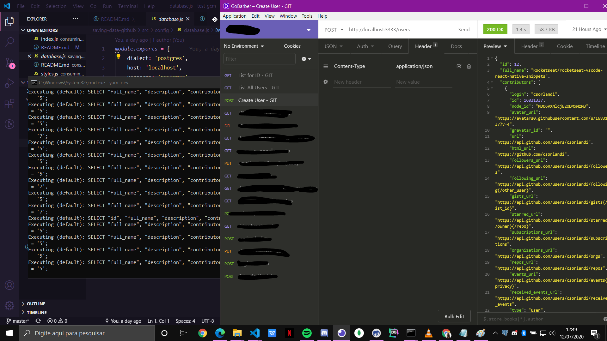
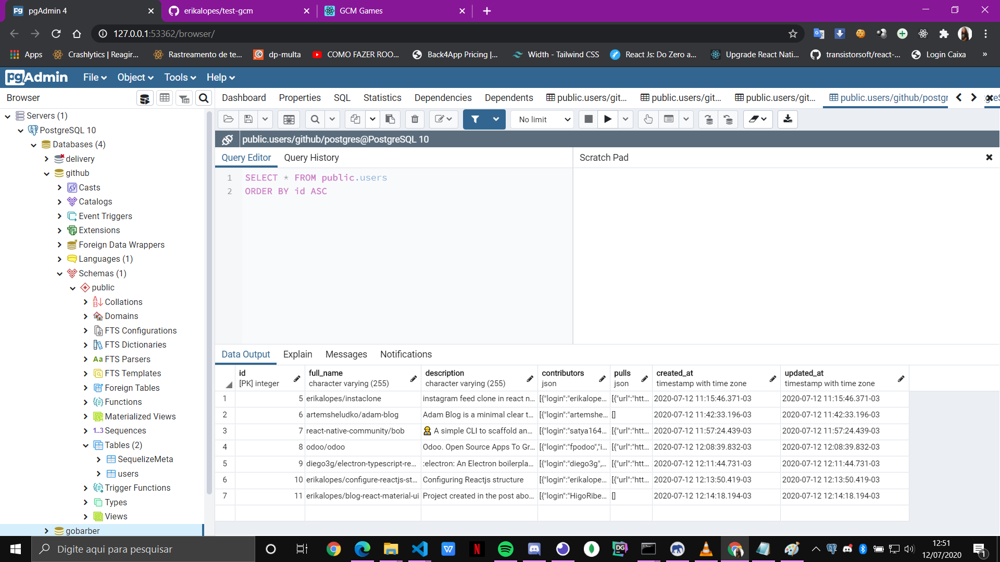

#  Consuming github api 

This is an application with Frontend (**React.js & Styled-Components**) and Backend (**Node.js, Express, Postgres, Sequelize**).

- To start, clone the repository:

> git clone https://github.com/erikalopes/test-gcm.git

# How to access (backend)

 - go to the folder: `/saving-data-github` and run 

> yarn

 or 

> npm install
- configure the database configuration file called: `test-gcm\saving-data-github\src\config\database.js`
- open pgAdmin (this application comes with PostgreSQL) and create a database called `github`.
-  open a terminal in that backend folder and type `yarn sequelize db: migrate`, to create the tables in postgres

- and finally, run the command `yarn dev` to start the application.

****be aware, that to have access to the Backend application, it is necessary to have `Postman or Insomnia` as tools, and `Postgres` and `NodeJs` installed on your machine.****

# How to access (frontend)
  
- to run Frontend on your machine, first enter the folder: `/consuming-github-api`
- run 

> yarn

or 

> npm install
- done! now test.

## Notes in PT_br
- Como dito anteriormente, eu usei Postgres para fazer o banco de dados, para acessá-lo no nodeJs instalei o Sequelize, para administrar os Models do usuário. A escolha do banco ficou aberta, então optei por esse, porque eu estou estudando bastante o postgres com node, então aproveitei para aprender ao mesmo tempo que resolvo esse teste. 

- Vale ressaltar, que para o banco de dados funcionar, é necessário ter o Postgres instalado em sua máquina, e configure o arquivo de configuração do banco de dados no backend da aplicação `(/saving-data-github/config/database.js).`

- Ao instalar o postgres, automaticamente se instala o PGAdmin, nele você cria o banco de dados chamado "`github`" ou como quiser (só não esquece de configurar `(/saving-data-github/config/database.js)`.
- Para o front end, apenas usei o React.js e Styled-components para estilizar a página. 

>     Abaixo coloquei alguns screenshots da aplicação final rodando na minha máquina.

# frontend screenshots

